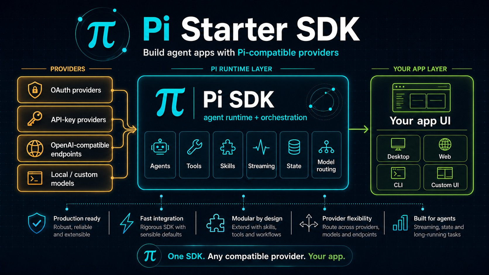
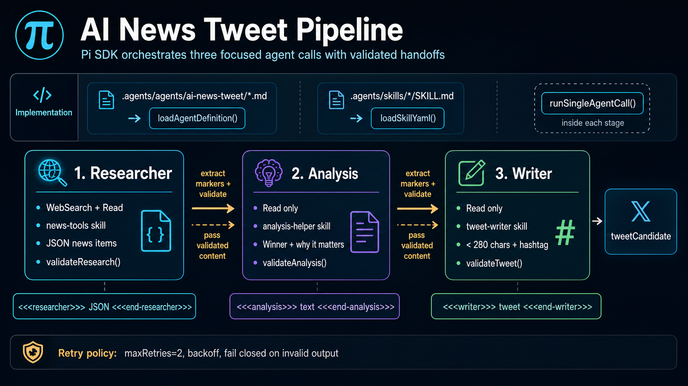

# Pi SDK Starter Kit

[](https://www.npmjs.com/package/@earendil-works/pi-coding-agent)
[](LICENSE)

> A batteries-included starter for building agentic desktop apps with Pi SDK and configurable providers.



## Why This Exists

This starter demonstrates how to build real desktop agent apps without mixing the agent runtime, provider routing, and UI shell into one hard-to-change layer.

1. **Separate agent runtime from UI** - Pi SDK handles agents, tools, skills, streaming, state, and model routing.
2. **Support provider flexibility** - Configure Pi SDK OAuth and API-key providers from Settings.
3. **Ship useful app patterns** - The demo app shows a multi-stage agent workflow with scoped skills.
4. **Keep the starter practical** - Electron and React are the app shell, not the agent runtime.

## Demo: AI News Tweet Pipeline

The demo app runs a three-stage workflow: researcher -> analyst -> writer. Each stage has a focused prompt and the pipeline verifies marked outputs instead of trusting informal model claims.



```bash
bun run test:ai-news-tweet
```

## Quick Start

**Prerequisites:**

- Node.js v18+
- Bun available on PATH, or use the bundled runtime after first setup
- Provider credentials configured through the starter's Pi SDK auth flow

> **Use `bun install`, not `npm install`.** The native-module rebuild step (`electron-rebuild`) is incompatible with current Electron versions and will fail under npm. Bun uses the prebuilt `better-sqlite3` binary directly, so install completes cleanly.

```bash
bun install
bun run dev
```

The starter embeds `@earendil-works/pi-coding-agent`; users do not need a separate global Pi install. Provider credentials are intentionally separate from the Pi CLI and are stored in the shared Pi SDK auth file:

```text
~/.pi-sdk/auth.json
```

Project-specific model/provider catalogs live with the project:

```text
<project>/.pi-sdk/models.json
<project>/.pi-sdk/config.json
```

On a fresh install, open Settings -> Models & Providers to authenticate a provider and choose the fast/smart/deep model routing.

## Project Structure

```text
.agents/
  agents/ai-news-tweet/     # Agent definitions
  skills/                   # Skill definitions with scripts
docs/                       # Developer docs
scripts/                    # Build, test, and runtime setup scripts
src/
  main/                     # Electron main process and Pi SDK session runner
  renderer/                 # React frontend
  preload/                  # IPC bridge
  shared/apps/              # App manifests and registry
resources/                  # Runtime binaries downloaded on demand
```

Project-local settings are stored in `.pi-sdk/config.json`. Pi SDK credentials are stored globally for SDK apps in `~/.pi-sdk/auth.json`; project model catalogs are stored in `.pi-sdk/models.json`.

## Pi SDK Runtime Layout

The app owns its Pi SDK path policy instead of relying on Pi CLI defaults. This avoids reading or mutating the user's global Pi CLI config at `~/.pi/agent` while still allowing multiple Pi SDK apps to share credentials.

```text
~/.pi-sdk/auth.json          # Shared Pi SDK credentials, OAuth tokens, API keys
<project>/.pi-sdk/models.json # Project-specific provider/model catalog
<project>/.pi-sdk/config.json # Project-specific starter settings
```

This split keeps secrets out of project exports while letting each starter project define its own providers, local endpoints, proxies, and model defaults.

## Building Your Own App

1. Copy the `_template` app.
2. Add or reuse skills under `.agents/skills`.
3. Add app-specific agents under `.agents/agents/<app-id>` when needed.
4. Register the app manifest and route.
5. Run `bun run dev`.

See [docs/BUILDING_APPS.md](docs/BUILDING_APPS.md) for the full guide.

## Providers

Provider auth and model routing are configured through Settings using the Pi SDK provider/model registry.

| Provider                   | Auth                                                                    |
| -------------------------- | ----------------------------------------------------------------------- |
| OAuth providers            | Pi SDK OAuth credentials in `~/.pi-sdk/auth.json`                       |
| Other compatible providers | Project `.pi-sdk/models.json` plus credentials in `~/.pi-sdk/auth.json` |

Settings lets you choose provider/model pairs for the fast, smart, and deep tiers.

## Runtime Binaries

The app downloads local tooling on demand:

- **bun** - JavaScript runtime for skill scripts
- **uv** - Python package/runtime helper for Python-based skills
- **jq** - JSON utility
- **git + msys2** on Windows - Shell utilities used by agent tools

No global runtime install is required for packaged apps.

## Commands

```bash
bun run dev                    # Start dev mode
bun run build                  # Build for production
bun run typecheck              # Type check
bun run lint                   # Lint code
bun run test:ai-news-tweet     # Run pipeline smoke test
bun run test:bypass-auth       # Verify Pi SDK auth
bun run test:context-window    # Verify expected context windows
bun run test:export            # Verify standalone export flow
```

## Troubleshooting

See [docs/TROUBLESHOOTING.md](docs/TROUBLESHOOTING.md).

## License

MIT
